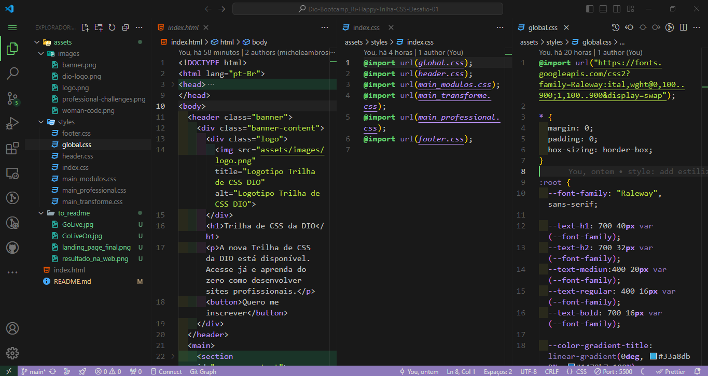
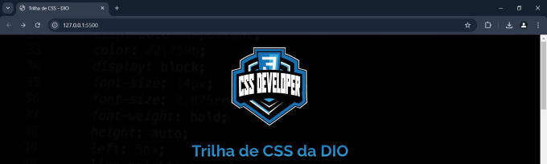

# Desafio 01: Criando sua primeira Landing Page com HTML e CSS

## Página estática da Landing Page CSS Developer 

### 📜 Sobre o Projeto
Este é o primeiro desafio da Trilha de CSS da DIO no Bootcamp Ri Happy de Front-End. 
Foi proposto estilizar toda uma landing page (HTML já estava disponível) e implementar todo o aprendizado adquirido durante a trilha de fundamentos do CSS, ministrado pela instrutora Michele Ambrosio e assim colocar em prática os fundamentos do CSS (as propriedades básicas da linguagem de estilização, além de trabalhar com as unidades de medidas relativas e absolutas, entre outras).

### 🔗 Links Úteis

- 

- 

### ✅ Status do Projeto

**Concluído**

### 🎥 Demonstração

#### Tela inicial

  

#### Telas do projeto

  

### 🧩 Desafio

O desafio proposto neste projeto foi aplicar as estilizações necessárias e em conformidade com o projeto desenvolvido no Figma, sem a visualização do resultado final que se encontrava no GitHub.

### Figma com a diagração do protótipo do desafio da Landing Page CSS Developer para se basear.

[Link do Figma](https://www.figma.com/file/3PiokoJj9IhGDnNiWAJbz7/DIO---Desafio-01?node-id=2%3A6) 

### Para acessar o resultado final da Landing Page CSS Developer criada a partir do desafio!

[Clique aqui](https://micheleambrosio.github.io/dio-trilha-css-desafio-01/) 

### 📝 Requisitos da Aplicação

| Item  | Descrição                                                                 |
|-------|---------------------------------------------------------------------------|
|  1    | A página deve ser desenvolvida em HTML, CSS.                              |
|  2    | A página deve seguir os design do Figma.                                  |
|  3    | Modelagem do layout, formatos, tipografias, cores e organização no Figma. |
|  3.1  | Opcional: Modelagem de modo livre.                                        |

### 🚀 Plano do Projeto

No desenvolvimento desta aplicação, foram aplicados os seguintes conceitos:

| Item  | Descrição                                   |
|-------|---------------------------------------------|
|  1    | HTML                                        |
|  2    | CSS                                         |
|  3    | Prototipagem (Figma)                        |

### 🛠 Tecnologias Utilizadas

- **Visual Studio Code**
- **HTML**
- **CSS**
- **Documentação**
- **ChatGpt**

### 💡 Reflexões

Desenvolver este projeto foi mais um passo no meu desenvolvimento na arte da programação, proporcionando um aprofundamento nas práticas de desenvolvimento web. Foi possível explorar a organização e flexibilidade do CSS, além de desenvolver sobre a importância de uma estruturação inteligente para facilitar a manutenção futura da página.

### 📦 Como Executar o Projeto

1. Clone o repositório:

   https://github.com/ricardo-werner/Dio-Bootcamp_Ri-Happy-Trilha-CSS-Desafio-01.git

3. Abra o projeto no Visual Studio Code e ative o Go Live:
    
   

     
   

   

     
   

4. Visualize o resultado na página web:

   

     
   

### 🙋‍♂️ Autor
Ricardo Werner 
Dev em Desenvolvimento